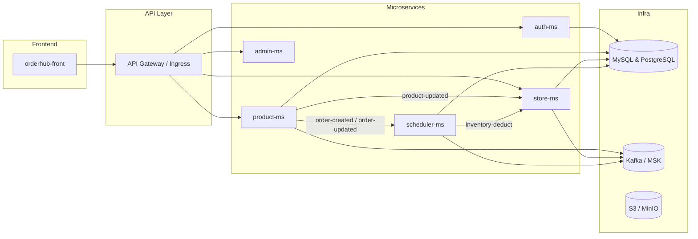

# 🛒 OrderHub – 모듈형 커머스 & 주문·재고 통합 플랫폼

> **OrderHub**는 중소형 리테일·이커머스 점주가 **“하나의 화면”** 으로 상품 관리부터 주문·재고·매장 운영까지 처리할 수 있도록 설계된 마이크로서비스 기반 SaaS 플랫폼입니다.

<div align="center">
  
  
  
  
  
</div>

---

## 📦 저장소 구조

| Repo                       | 주 언어                   | 간단 설명                                          |
| -------------------------- | ---------------------- | ---------------------------------------------- |
| **orderhub-front**         | JavaScript (React)     | B2B·관리자용 SPA. API Gateway ↔️ Microservices 연동  |
| **auth-microservice**      | Java (Spring Security) | OAuth2 / JWT 인증, 토큰 재발급, RBAC                  |
| **product-microservice**   | Java (Spring Boot)     | 상품, 카테고리, 할인, 주문 API & Kafka 이벤트               |
| **store-microservice**     | Kotlin (Spring Boot)   | 매장, 인벤토리, 재고 관리 & ‘product‑updated’ 리스너        |
| **scheduler-microservice** | Java (Spring Batch)    | 정기 주문 처리, Outbox 패턴, 배치 + Kafka 퍼블리셔           |
| **admin-microservice**     | Java (Spring Boot)     | CS·운영팀 전용 Admin 서버                 |
| **orderhub-cloud**         | HCL / Terraform        | AWS EKS, RDS, MSK, S3 등 IaC 및 Helm 차트          |
| **.github**                | YAML                   | 공통 CI / CD 워크플로우 (build, test, Docker, deploy) |

---

## 🏗️ 전체 아키텍처 개요



* **Event Driven** – 각 서비스는 Kafka 토픽으로 상태 변경 이벤트를 발행/구독해 데이터 일관성을 유지합니다.
* **Transactional Outbox** – Scheduler MS는 Outbox 테이블 → Publisher 패턴으로 ‘exact‑once’ 전송 보장.
* **API Gateway** – 인증 헤더 전달·라우팅·속도 제한.

---

## ⚙️ 빠른 시작 (로컬)

> **Docker Compose** 파일은 `orderhub-cloud/local-compose.yaml` 에 있습니다.

```bash
git clone https://github.com/order-hub/orderhub-cloud.git
cd orderhub-cloud

# 인프라 (DB + Kafka + MinIO) 기동
docker compose -f local-compose.yaml up -d infra

# 마이크로서비스 빌드 & 기동
docker compose -f local-compose.yaml up -d product-ms store-ms auth-ms scheduler-ms

# 프론트엔드
cd ../orderhub-front
npm ci && npm run dev   # <http://localhost:3000>
```

각 서비스는 80xx 번 포트를 기본 사용합니다 (`8001` product, `8002` store …).

---

## 🔐 인증 흐름

1. **로그인** – Auth MS가 JWT(Access + Refresh)를 발급 → 쿠키 저장.
2. **Gateway** – 매 요청에서 Access 토큰 검증, Role 헤더 주입.
3. **서비스** – `@PreAuthorize` & RBAC 으로 세부 권한 제어.

---

## 🧪 CI / CD

| 단계            | 설명                                         |
| ------------- | ------------------------------------------ |
| **Build**     | Gradle / npm 캐시 → 단위 테스트 실행                |
| **Dockerize** | Jib (Java) / docker buildx (Node) 로 이미지 생성 |
| **Push**      | GitHub → GHCR or ECR                       |
| **Deploy**    | Terraform → Helm upgrade (Argo CD)         |


---

## 📈 추후 개선 로드맵

* [ ] **API Gateway**: Spring Cloud Gateway → Envoy 전환 검토
* [ ] **Event Sourcing**: 주문 흐름 CQRS 적용
* [ ] **Observability**: OpenTelemetry + Prometheus + Grafana
* [ ] **멀티테넌시**: 테넌트별 DB 파티셔닝 전략

기여 환영합니다! 이슈·PR 언제든 열어주세요 😊
